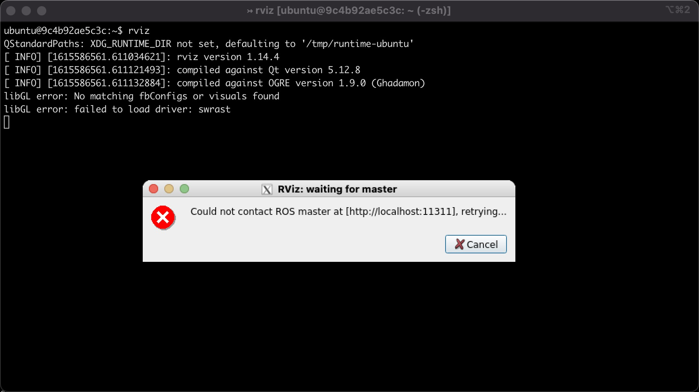

# ros-docker

Run ROS in a docker container, complete with X11 forwarding on macOS. Includes ROS 1 and 2.

# Instructions

```sh
$ bin/dc            # show help
$ bin/dc build      # build container
$ bin/dc up         # start container
$ bin/dc stop       # stop (and rm) container
$ bin/dc restart    # stop (and rm) and restart container

$ bin/dc bash       # jump into shell inside contianer
$ bin/dc tmux       # jump into tmux inside container (with iTerm integration)
$ bin/dc ssh        # ssh into container (with with X forwarding)
$ bin/dc tmssh      # run tmux (with iTerm integration) over ssh (with X forwarding) [recommended]
```

Home directory is mapped locally to `./run/home/ubuntu`.

Edit `~/.bashrc` inside the container (or `./run/home/ubuntu/.bashrc` on your host) to uncomment `setup.bash` for ROS 1 or ROS 2.

## Proof


